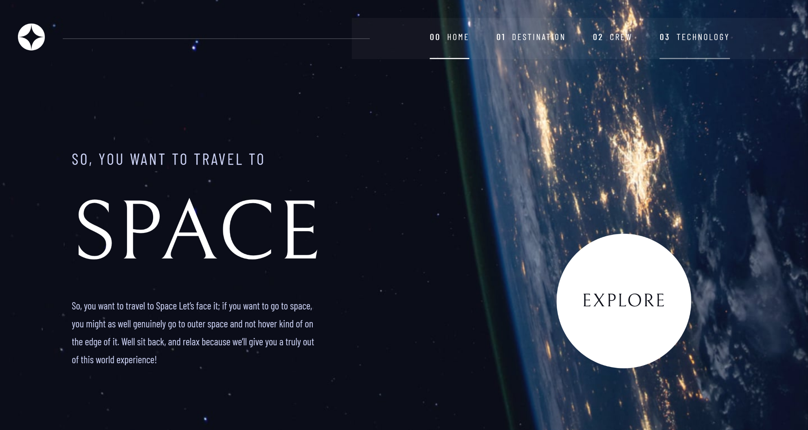

# Frontend Mentor - Space tourism website solution

This is a solution to the [Space tourism website challenge on Frontend Mentor](https://www.frontendmentor.io/challenges/space-tourism-multipage-website-gRWj1URZ3). Frontend Mentor challenges help you improve your coding skills by building realistic projects.

&nbsp;

## Table of contents

- [Overview](#overview)
  - [The challenge](#the-challenge)
  - [Screenshot](#screenshot)
  - [Links](#links)
- [My process](#my-process)
  - [Built with](#built-with)
- [Author](#author)

&nbsp;

## Overview

### The challenge

Users should be able to:

- View the optimal layout for each of the website's pages depending on their device's screen size
- See hover states for all interactive elements on the page
- View each page and be able to toggle between the tabs to see new information

&nbsp;

### Screenshot

&nbsp;

### Links

- Solution URL: [Code - Github](https://github.com/tonylubin/space_tourism.git)
- Live Site URL: [Live Website](https://your-live-site-url.com)

## My process

### Built with

- Semantic HTML5 markup
- SCSS with BEM & CSS Modules
- Flexbox
- CSS Grid
- Mobile-first workflow
- [React](https://reactjs.org/) - JS library
- React Router - for navigation
- Hamburger menu - purpose built with added CSS `transition` for smooth appearance.  
- Hooks - `useState()` & `createContext()` for handling data/state
- Text/data from json file to display components/content
- JS functionality
  - `map` , `arrays & push method` , `objects & destructuring` , conditional rendering with `ternary operator`
- *"React-Responsive"* npm pkg for handling media query when window is re-sized to conditionally select "landscape or portrait" images.

## Author

- Website - [tony lubin](https://anthonylubin-65130.web.app/)
- Frontend Mentor - [@tonylubin](https://www.frontendmentor.io/profile/tonylubin)
